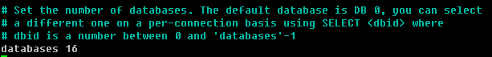

# redis 相关讨论

## why redis

* [redis介绍](https://redis.io/topics/introduction)
* [redis社区](https://redis.io/community) 

## 配置相关 

**打开后台运行**

**数据库个数**

**密码**

**最大客户数**

**rdb持久化**

**aof持久化**

## 基本数据结构

set hash set 

* [中文参考](http://doc.redisfans.com/)

## 重点关注

* [pipeline]()
* [lua script]()

## 一些例子

* [播放控制访问](example/play.md)
* [短信注册](example/sms.md)
* [车辆在线](example/online.md)

